# Learnings: how Pri Notes works

A walkthrough of how a small macOS app is put together, and how Pri Notes watches and edits Apple Notes
without any help from Notes itself. The diagrams are Mermaid; they render on GitHub and in most
Markdown viewers. The pseudocode follows the real code closely; file names point to where each piece
lives.

---

## 1. The big picture

Notes has no plug-in or extension API for its editor. So Pri Notes works **from the outside**, the way
assistive software such as screen readers does. It uses three macOS facilities:

1. **An event tap**, to notice what you type.
2. **The Accessibility (AX) API**, to read the note's text and cursor, and to press Notes' own menu items.
3. **Two pasteboards**: the *font pasteboard*, to apply fonts, sizes and colours with Notes' own Paste Style,
   and the ordinary clipboard, only for links and equation images.

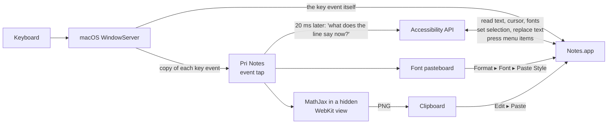

Notes never knows Pri Notes exists. It just sees text being replaced, menu items being chosen and
pastes happening, as if you did them yourself very quickly.

---

## 2. Anatomy of a macOS app

### 2.1 An app is a folder

`Pri Notes.app` is a directory with a fixed layout. Finder shows it as one icon.

```
Pri Notes.app/
└── Contents/
    ├── Info.plist             ← identity card: name, bundle id, icon, "no Dock icon" flag
    ├── MacOS/PriNotes         ← the compiled executable (arm64 machine code)
    ├── Resources/
    │   ├── AppIcon.icns       ← icon at 16…1024 px
    │   └── mathjax/           ← tex-svg-full.js + render.html
    └── _CodeSignature/        ← signature added by `codesign`
```

The `Info.plist` keys that matter here:

| Key | Value | Why |
|---|---|---|
| `CFBundleIdentifier` | `local.prinotes` | macOS's permission database keys on this |
| `CFBundleExecutable` | `PriNotes` | which binary in `MacOS/` to run |
| `CFBundleIconFile` | `AppIcon` | Finder/Dock icon |
| `LSUIElement` | `true` | "agent" app: no Dock icon, no app menu, lives in the menu bar |

Xcode normally builds all of this. The project needs only the Command Line Tools, so
`scripts/build_app.sh` does it by hand:

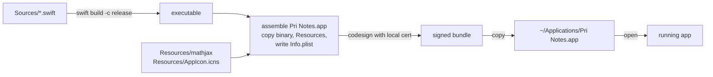

### 2.2 How an AppKit app runs: the run loop

A Cocoa app is one long loop on the **main thread**. It waits for something to happen (a key, a click,
a timer, a message from another process), runs the handler for it, and goes back to waiting. All UI
work, and all of our Accessibility calls, happen on this thread.

```text
main():                                          # Sources/PriNotes/main.swift
    app = NSApplication.shared
    app.delegate = AppDelegate()
    app.setActivationPolicy(.accessory)          # menu-bar app, no Dock icon
    app.run()                                    # ← never returns; this IS the run loop

AppDelegate.applicationDidFinishLaunching():
    register default settings
    statusItem = NSStatusBar.system.statusItem(...)
    statusItem.image = MenuBarIcon.make()        # text lines + "P" badge, a template image
    statusItem.menu = buildMenu()                # rebuilt each time it opens
    monitor.onTrigger  = { formatter.check(); preview.update(); toolbar.update() }
    monitor.onActivity = { preview.update(); toolbar.update() }   # any key or click in Notes
    monitor.onHotkey   = { formatter.toggleEquation(); preview.update() }   # ⌃⌘E
    monitor.onUnderlineShortcut = { styler.apply(.toggle(.underline)) }   # ⌘U, see §7.6
    startWhenTrusted()                           # see §3
```

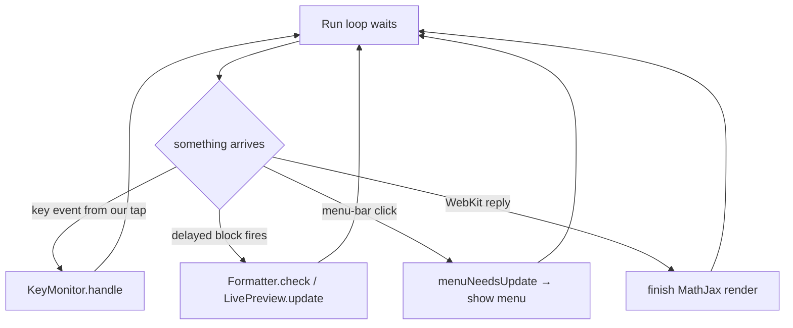

*Template image* means the icon is drawn in black plus transparency only. macOS recolours it for
light and dark menu bars and for the highlighted state.

---

## 3. Permissions: TCC, Accessibility and code signing

macOS guards "watch every keystroke" and "control other apps" behind **Accessibility** permission, in
System Settings → Privacy & Security → Accessibility. The database behind that list is called
**TCC** (Transparency, Consent and Control).

TCC doesn't remember an app by its path. It remembers the app's **code signature requirement**:
bundle id plus signing certificate. That is why signing matters:

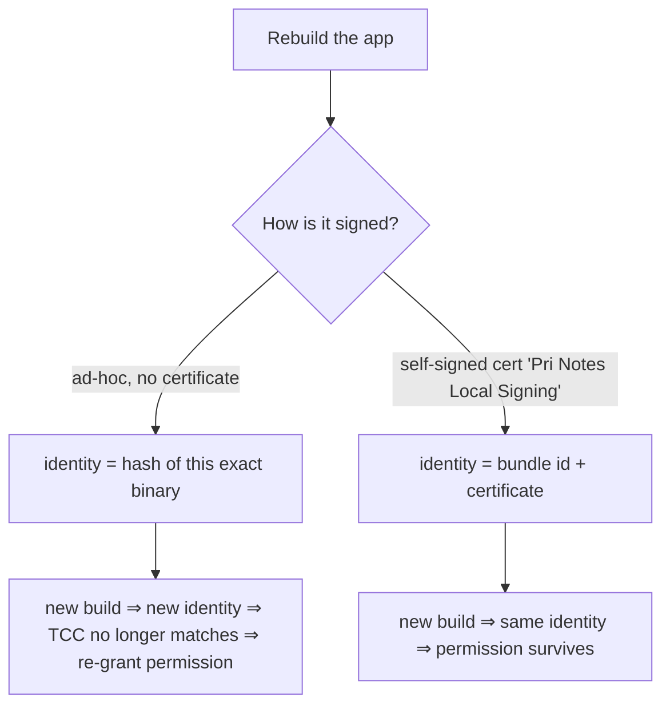

At launch:

```text
startWhenTrusted():
    if AXIsProcessTrustedWithOptions(prompt: true):   # shows the system prompt the first time
        monitor.start()
    else:
        every 2 s: if AXIsProcessTrusted(): monitor.start(); stop polling
```

---

## 4. Seeing keystrokes: the CGEventTap

Every input event travels from the hardware (HID) to the **WindowServer**, which routes it to the
frontmost app. An **event tap** is a hook into that route. `CGEvent.tapCreate` with
`.cgSessionEventTap` sees every key and click in your login session before the target app does.

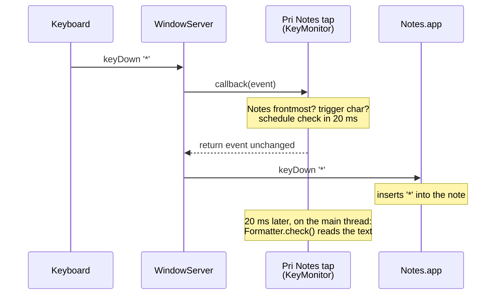

The callback must be **fast**, because the whole system's input waits on it. If it's slow, macOS
disables the tap (`tapDisabledByTimeout`) and we re-enable it. So the callback only filters and
schedules; the real work happens later on the run loop.

```text
KeyMonitor.handle(type, event) -> swallow?        # Sources/PriNotes/KeyMonitor.swift
    if type is tapDisabled*:  re-enable tap; return false
    if Notes is not frontmost:              return false      # outside Notes: do nothing at all
    if event carries our synthetic marker:  return false      # ignore keys we posted ourselves

    if type == leftMouseUp:  after 30 ms → onActivity();  return false

    if modifiers == ⌃⌘ and key == E:
        after 0 ms → onHotkey()
        return true                                           # the ONLY event we swallow

    after 60 ms → onActivity()                                # cursor may have moved: update preview
    if ⌘ or ⌃ held: return false                              # shortcuts aren't typing
    ch = event.unicodeString
    if ch in { space * _ ~ $ ` }:  after 20 ms → onTrigger()  # let Notes insert it first
    return false
```

Why wait 20 ms? At callback time Notes hasn't inserted the character yet. Reading the text straight
away would show the line *before* the keystroke.

"Is Notes frontmost?" is tracked with an `NSWorkspace.didActivateApplicationNotification` observer,
so the check is a cheap boolean.

---

## 5. Reading Notes: the Accessibility tree

Every app exposes its UI to assistive tools as a tree of **AXUIElements**. Each element has a
**role** (`AXWindow`, `AXButton`, `AXTextArea`, `AXMenuItem`, …) and **attributes**. Some attributes
are plain, like `AXValue` = the text. Others are **parameterized**, like "bounds of characters 10–11".

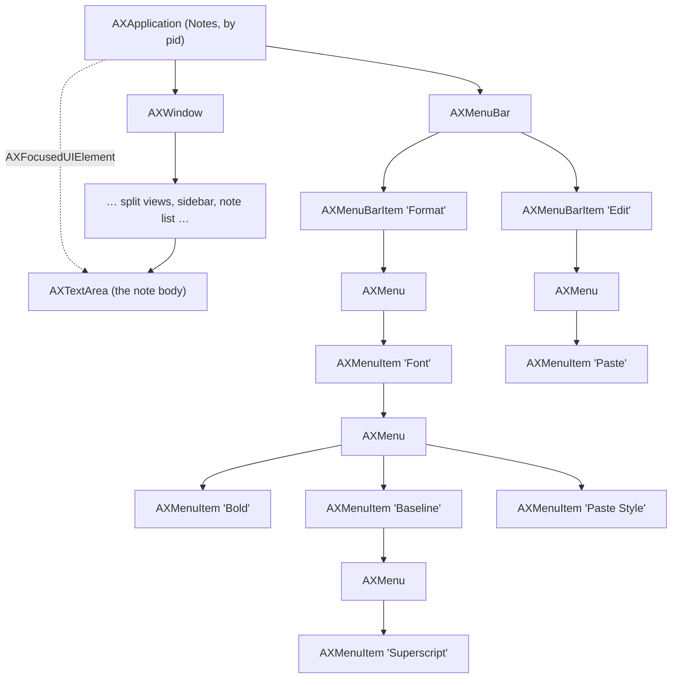

We never walk down to the text area. We ask the application for its **focused element** and check
that its role is `AXTextArea`. That rules out the search field, the sidebar and the title bar.

```text
NotesAX.focusedTextArea():                        # Sources/PriNotes/NotesAX.swift
    el = AXUIElementCopyAttributeValue(app, "AXFocusedUIElement")
    return el if el.role == "AXTextArea" else nil

Attributes we read from the text area:
    AXValue                        → the whole note as a string (attachments appear as U+FFFC)
    AXSelectedTextRange            → cursor/selection as (location, length) in UTF-16 units

Parameterized attributes:
    AXAttributedStringForRange(r)  → font name/size at r   (skip code blocks, match body size)
    AXBoundsForRange(r)            → screen rectangle of r (where to put the preview panel)
```

All offsets are **UTF-16 code units**, the same units as `NSString`. The Swift code therefore uses
`NSString` and `NSRange` throughout, not Swift `String` indices.

---

## 6. Deciding what to do: the pure core

Everything that is only *logic* lives in the `PriNotesCore` library. It has no AppKit and no
Accessibility, so `swift run selftest` can test it.

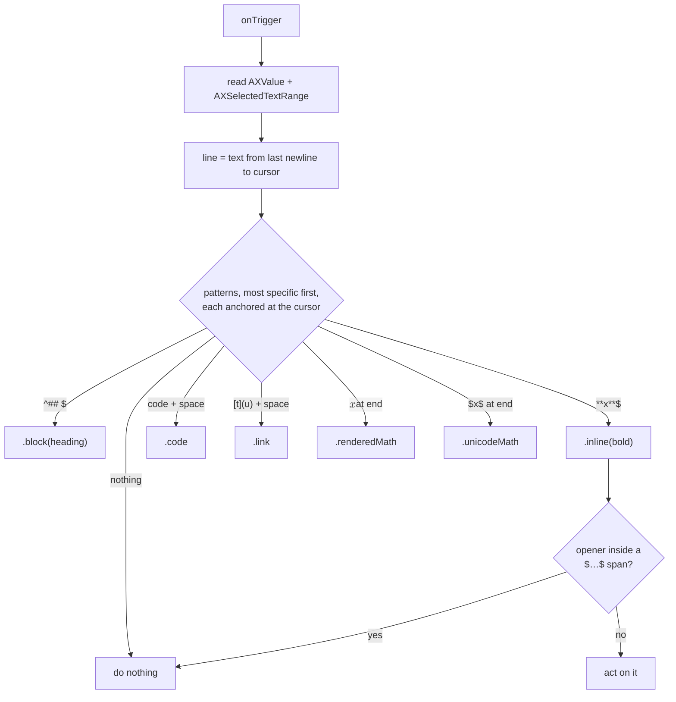

```text
Rules.detect(text, cursor, enabled) -> Action?     # Sources/PriNotesCore/Rules.swift
    line = text[lastNewline(before: cursor) ..< cursor]
    for pattern in patterns where pattern.family in enabled:
        if m = pattern.regex.match(line):          # every regex ends with `$` = at the cursor
            if pattern is Markdown and MathSpans.span(at: m.start) != nil: continue
            return pattern.makeAction(m)           # ranges converted to absolute offsets
    return nil
```

The detector is **stateless**. It doesn't track what you typed; it re-reads the line each time. That
makes it robust to clicks, undo, pasting and moving the cursor.

### 6.1 LaTeX → text runs (recursive descent)

`$…$` math is converted by a small parser, not by regex replacements. The output is a list of
**runs**: text plus baseline level (0 normal, +1 superscript, −1 subscript) plus an italic flag.

```text
LatexUnicode.convertRich("B_\phi^2 + x")          # Sources/PriNotesCore/LatexUnicode.swift
  → [ "B" level 0 italic ] [ "ϕ" level −1 italic ] [ "2" level +1 upright ] [ " + " 0 upright ] [ "x" 0 italic ]

parseSequence(level):
    runs = []
    while not end and next != '}':
        atom = parseAtom()            # one char | {group} | \command with its arguments
        if next is '^' or '_':
            script = parseAtom() at level ± 1     # nesting accumulates: x^{a^b} → b at +2
        runs += atom, script
    return merge(runs)                # join neighbours with equal level and italic

parseAtom():
    letter a–z, A–Z          → italic
    digit / operator         → upright; binary + − = get spaces
    \alpha … \omega          → Greek, lowercase italic, uppercase upright
    \frac{a}{b}              → "(a)/(b)", with the child runs spliced in, levels kept
    \mathrm{…}, \sin, \text  → upright
    \mathbb{R}               → ℝ
    unknown \foo             → "foo"
```

---

## 7. Writing to Notes: four techniques

This is the core lesson. There are four ways to change another app's document from outside, and each
feature uses whichever keeps Notes' own formatting model intact.

| Technique | API | Used for | Why this one |
|---|---|---|---|
| **A. Replace text** | set `AXSelectedTextRange`, then set `AXSelectedText` | removing `**`, `# `, deleting sources | goes through the text view's normal edit path, so ⌘Z works |
| **B. Press a menu item** | `AXUIElementPerformAction(item, "AXPress")` | Bold, Heading, Checklist, Superscript… | Notes applies its *own* styles (a real Heading, not just a big font) |
| **C. Paste Style** | one-character RTF sample on the *font* pasteboard, press Format ▸ Font ▸ Paste Style | fonts (Palatino, Menlo, toolbar family), exact sizes, colours, bold/italic | changes style without touching the text or your clipboard |
| **D. Paste** | put data on the clipboard, press Edit ▸ Paste | links, equation images | the only way to insert a link or an image |

### 7.1 A heading: `## ` → Heading

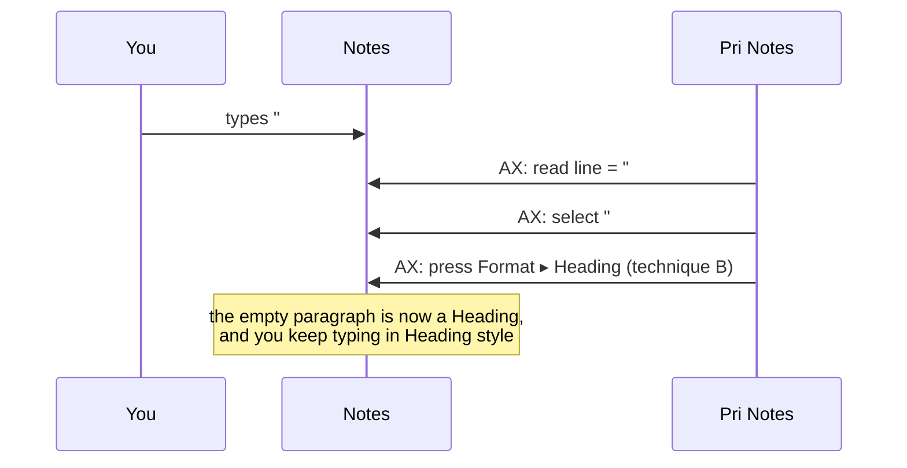

### 7.2 Bold: `**word**`

```text
applyInline(bold, range of "**word**", inner = "word"):     # Sources/PriNotes/Formatter.swift
    replace range with "word"                        # A: markers gone
    select "word";           press Format ▸ Font ▸ Bold   # B: bold on
    put cursor after "word"; press Format ▸ Font ▸ Bold   # B: with an empty selection this toggles
                                                          #    the *typing* style, so what you
                                                          #    type next isn't bold
```

### 7.3 Menu items are found by title

```text
pressMenuItem(path = ["Baseline", "Superscript"]):
    node = app.AXMenuBar
    for title in path:
        node = depth-first search under node for an AXMenuItem titled `title`
               (at the top level only the "Format" and "Edit" menus are searched)
    AXPress(node)
    cache node by path            # a menu walk costs ~10 ms, so remember it

fallback when the item isn't found: post the keyboard shortcut straight to Notes
    CGEvent(keyDown ⌘B).postToPid(notesPid)   # tagged with our marker so our own tap ignores it
```

Titles are matched in English. The titles themselves, including less obvious ones like "Paste Style"
and "Baseline ▸ Use Default", were found by searching the strings in Notes' own `MainMenu.nib`.

### 7.4 Fonts and colours: Paste Style via the font pasteboard

macOS has a second, separate pasteboard for **styles**. Format ▸ Font ▸ Copy Style puts the style
of the selected character on it, and **Paste Style** (`pasteFont:`) applies that style to the
selection without touching the text. Pri Notes writes its own one-character style sample there:

```text
StyleSample.rtf(font, colour, script direction):     # Sources/PriNotesCore/StyleSample.swift
    {\rtf1 {\fonttbl \f0 <AppKit font name>;}         # e.g. Palatino-Italic, .AppleSystemUIFontBold
           {\colortbl …}{\*\expandedcolortbl \cssrgb …}   # colour pinned to sRGB
           \f0 \fs<2×size> \cf1 [\super|\sub] x}

pasteStyles([(range, style)]):                        # Sources/PriNotes/SelectionStyler.swift
    save the user's font pasteboard
    for each (range, style):
        if the colour must be kept: read the stored colour with Copy Style
        write the sample; select range; press Format ▸ Font ▸ Paste Style
        wait until AX shows the new style on range   # Notes reads the pasteboard *after* the press
    restore the user's font pasteboard
```

Each detail in there was learned from a failure:
- **System font:** AppKit's RTF writer can't name the system font and writes Helvetica Neue, so the
  sample is hand-written with AppKit's own names.
- **Colour space:** a plain RTF colour table is read as Generic RGB, which shifted every colour
  lighter, so the sample uses `\expandedcolortbl` with `\cssrgb`.
- **Dark mode:** Notes *draws* explicit colours lighter than it stores them, and Accessibility reports
  the drawn colour, so colours that must be kept are read with Copy Style.
- **Waiting:** without the wait, the next sample replaced the pasteboard before Notes had read it,
  and nothing applied.

### 7.5 Inserting a text equation (no clipboard)

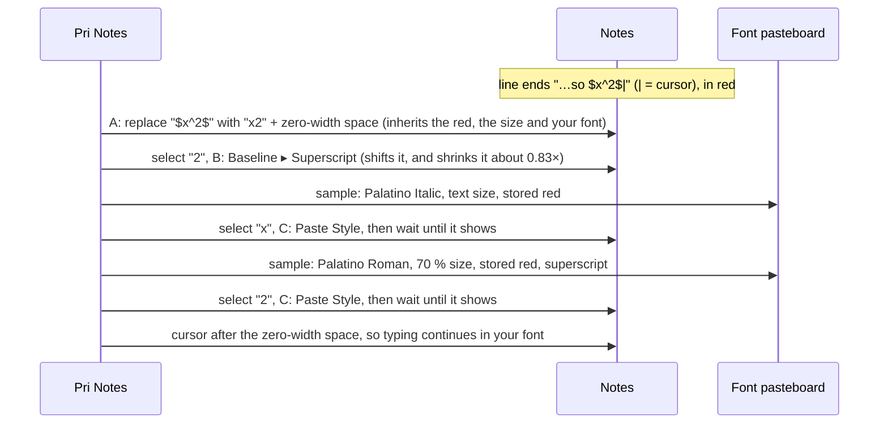

An earlier version pasted the equation as rich text with Edit ▸ **Paste and Retain Style**. Notes
decides whether that item is enabled from a stale view of the clipboard, so pressing it right after
writing the clipboard was often silently ignored. The lab showed it reported *disabled* before every
insert. Building on Paste Style instead removed the clipboard from equations entirely.

### 7.6 Toggles that only switch on

Driven through Accessibility, Notes' **Bold**, **Italic** and **Underline** items only ever *add* the
style. Underline won't switch off from the real ⌘U either. **Strikethrough** works both ways. So the
app decides the state itself:

```text
toggle(style, selection):                           # SelectionStyler.apply(.toggle)
    runs = style runs of the selection (equations excluded for B/I)
    turnOn = not every run already has it           # Pages-style
    B / I      → Paste Style each run with the font's bold/italic trait added or removed
    S          → press Strikethrough on each run that differs
    U on       → press Underline on each run without it
    U off      → for each underlined run (links skipped):
                    remember font, stored colour, size, script direction, strikethrough
                    delete the text, insert it again   # takes the preceding character's style
                    Paste Style the remembered style; re-add strikethrough
⌘U in Notes → swallowed by the event tap and routed here
```

RTF has no way to say "no underline" (`\ulnone` reads back as nothing), which is why removal has
to retype.

### 7.7 Clipboard etiquette (links and images)

```text
paste(snippet):
    saved = copy of every item and type on the general pasteboard
    pasteboard = snippet
    press Edit ▸ Paste
    after 0.5 s: if pasteboard.changeCount is still ours → restore `saved`
```

---

## 8. Equation images: MathJax in a hidden browser

`$$…$$` needs real typesetting. Requiring a TeX install (gigabytes, and missing on most Macs) would
be a heavy dependency, so we ship MathJax, a JavaScript LaTeX engine, and run it in an
**invisible `WKWebView`**. WebKit runs web content in separate helper processes (WebContent, GPU,
Networking); our app talks to them over IPC.

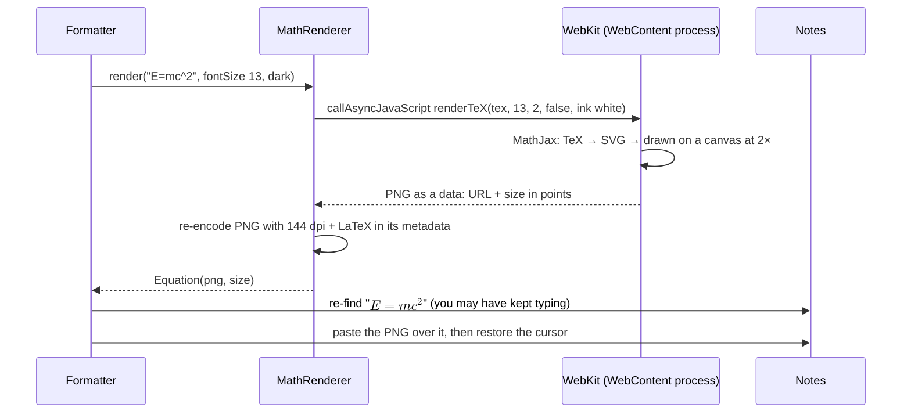

```text
render.html → renderTeX(tex, fontPx, scale, display, ink):
    svg = MathJax.tex2svg(tex)              # throws on bad LaTeX → shown in the menu and preview
    measure svg at fontPx
    img = new Image(svg as data: URL)
    canvas(size × scale).drawImage(img)     # transparent background, ink = #000 or #fff
    return { png: canvas.toDataURL(), width, height }
```

The image source is **embedded in the PNG metadata**. ⌃⌘E later copies the image back out of Notes
and reads it (§10).

---

## 9. The live preview panel

A floating window that must **never steal focus** from Notes:

```text
panel = NSPanel(style: [.nonactivatingPanel, .borderless])   # Sources/PriNotes/PreviewPanel.swift
panel.level = .floating
panel.ignoresMouseEvents = true
panel.contentView = PreviewContentView                       # blur material, manual layout, 12 pt padding

LivePreview.update():                  # after every key or click in Notes
    span = MathSpans.span(at cursor)   # inside an unfinished $… or $$…?
    if none or it looks like money ("$5 and"): hide; return
    anchor = AXBoundsForRange(opening '$')             # screen rect, top-left origin
    render span with MathJax (20 pt), or show the error text
    place the panel under the anchor
        # AX uses a top-left origin; AppKit uses bottom-left:
        cocoaY = primaryScreen.height − axRect.maxY
    panel.orderFrontRegardless()                       # show without activating our app
```

### 9.1 The selection toolbar

The same kind of panel, interactive this time. It has to take clicks without ever taking focus, or
Notes would lose the selection and its menu items would be disabled.

```text
ToolbarPanel: NSPanel(style: [.nonactivatingPanel, .borderless])   # Sources/PriNotes/SelectionToolbar.swift
    canBecomeKey = false                  # keyboard focus (and the selection) stay in Notes
    contentView = NSGlassEffectContainerView
                  └ four NSGlassEffectView capsules, sized by hand (glass reports no fitting size)
    buttons and pop-ups override acceptsFirstMouse → true   # the first click works

SelectionToolbar.update():                # after every key or click in Notes
    ignore clicks on the toolbar itself and while one of its menus is open
    0.3 s later: if the selection is non-empty
        read its style runs (AXAttributedStringForRange)   → fill Font / Typeface / B I U S / size / colour
        centre the panel above AXBoundsForRange(selection)
    menu pick or button → SelectionStyler.apply(change)     # §7.4 and §7.6
```

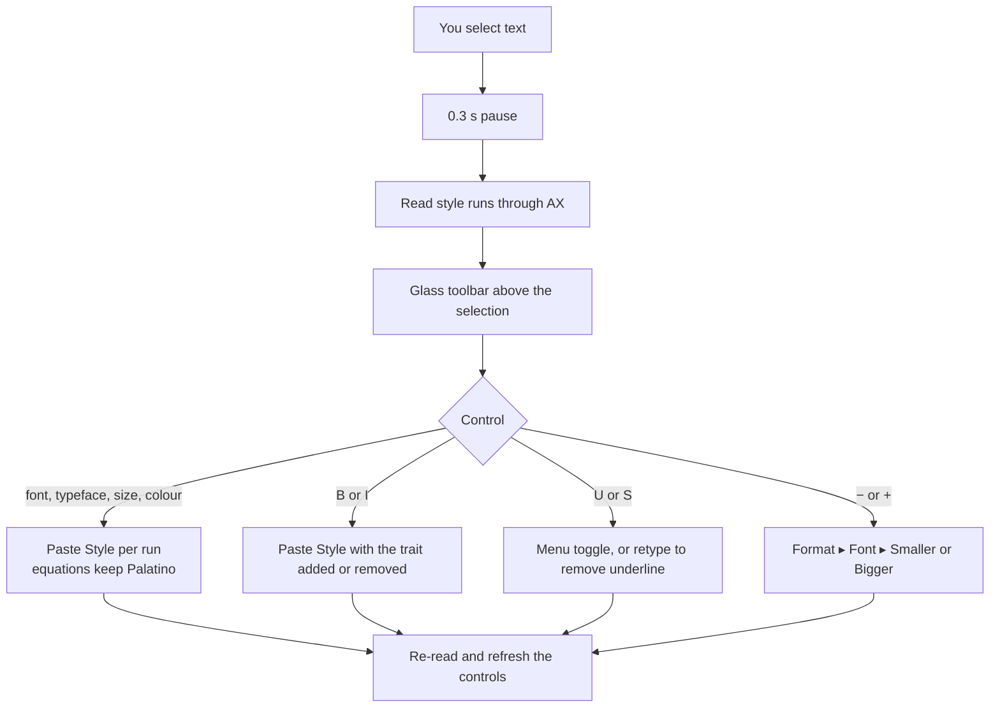

---

## 10. Re-editing with ⌃⌘E

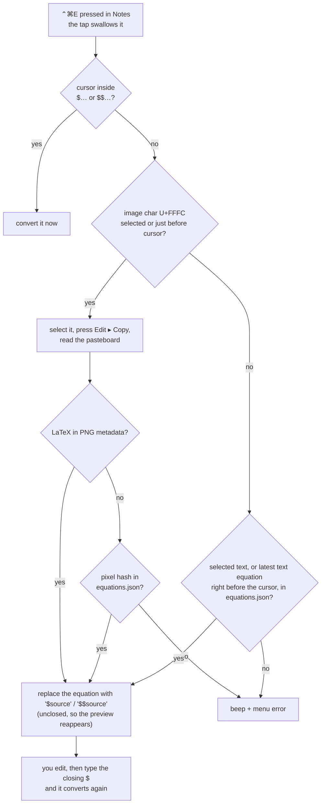

---

## 11. Offline by construction

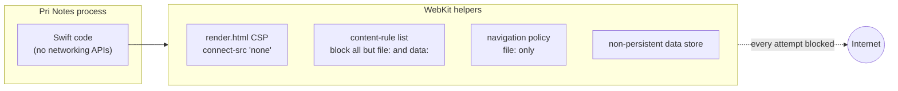

`PriNotes --network-test` checks this: it tries fetch, image and script loads from inside the
renderer and expects every one to be blocked.

---

## 12. Technologies used

| Technology | What it is | Where |
|---|---|---|
| Swift + Swift Package Manager | language and build tool | `Package.swift`, `Sources/` |
| AppKit | macOS UI framework: `NSApplication`, `NSStatusItem`, `NSMenu`, `NSPanel`, `NSImage`, `NSFontManager` | `main.swift`, `PreviewPanel.swift`, `SelectionToolbar.swift`, `MenuBarIcon.swift` |
| Liquid Glass (`NSGlassEffectView`) | the macOS 26 glass material | `PreviewPanel.swift`, `SelectionToolbar.swift` |
| Core Graphics event taps | `CGEvent.tapCreate`, `postToPid` | `KeyMonitor.swift`, `NotesAX.swift` |
| Accessibility API | `AXUIElement*`: read and control other apps | `NotesAX.swift` |
| NSPasteboard + RTF | the font pasteboard with hand-written RTF style samples for Paste Style; the clipboard for links and images | `StyleSample.swift`, `SelectionStyler.swift`, `Formatter.swift` |
| NSRegularExpression (ICU) | pattern detection | `Rules.swift` |
| WebKit (`WKWebView`) | hidden browser for MathJax, locked down | `MathRenderer.swift` |
| MathJax 3.2.2 | LaTeX → SVG in JavaScript (Apache-2.0) | `Resources/mathjax/` |
| ImageIO + CryptoKit | PNG metadata (dpi, LaTeX), pixel SHA-256 | `MathRenderer.swift` |
| Core Text | glyph ink bounds to centre the "P" | `MenuBarIcon.swift`, `make_icon.swift` |
| ServiceManagement | Launch at Login (`SMAppService`) | `main.swift` |
| `codesign`, keychain, TCC | identity and permissions | `scripts/build_app.sh` |
| `iconutil` | PNGs → `.icns` | `scripts/make_icon.swift` |

---

## 13. Gotchas worth remembering

1. **Wait before reading.** An event tap sees the key *before* the app handles it. Schedule reads a
   few ms later.
2. **UTF-16 everywhere.** AX ranges are `NSString` units; emoji and attachments (U+FFFC) take up
   positions.
3. **Prefer the app's own commands.** Pressing Format ▸ Heading gives a real Notes Heading. Setting a
   big bold font would only look like one.
4. **Style without touching text: Paste Style.** The font pasteboard plus Format ▸ Font ▸ Paste Style
   changes font, size and colour in place. Notes reads that pasteboard *after* the menu press returns,
   so wait for each change to land.
5. **RTF has sharp edges.**
   - It can't name the system font; AppKit writes Helvetica Neue, so hand-write AppKit's own names.
   - A plain colour table reads back as Generic RGB; use `\expandedcolortbl` with `\cssrgb`.
   - It can't say "no underline" at all.
6. **Signing identity is permission identity.** Ad-hoc signing means re-granting Accessibility after
   every build.
7. **Accessibility and the App Sandbox don't mix.** Offline has to be enforced inside the app,
   through WebKit rules and CSP, not by the sandbox.
8. **Keep logic out of the UI layer.** The pure core (`Rules`, `MathSpans`, `LatexUnicode`) is where
   most bugs were caught, by `swift run selftest`, without touching Notes.

9. **Don't trust a menu item's name.** Driven through AX, Notes' Bold, Italic and Underline only switch on.
   Paste and Retain Style silently does nothing when Notes thinks the clipboard is empty. Everything is
   disabled when Notes isn't frontmost. Measure the result through AX instead of assuming.
10. **What you read isn't always what's stored.** Accessibility reports colours as drawn, and dark
    mode draws them lighter. Copy Style gives the stored value.
11. **Test in the real app.** The `--notes-lab` harness (a note starting "PRI-LAB") found every one of
    the Notes behaviours above, which reasoning alone got wrong more than once.
